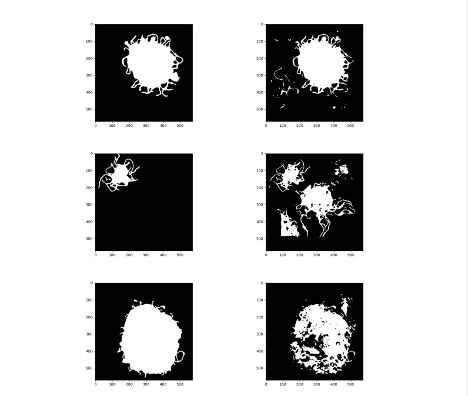
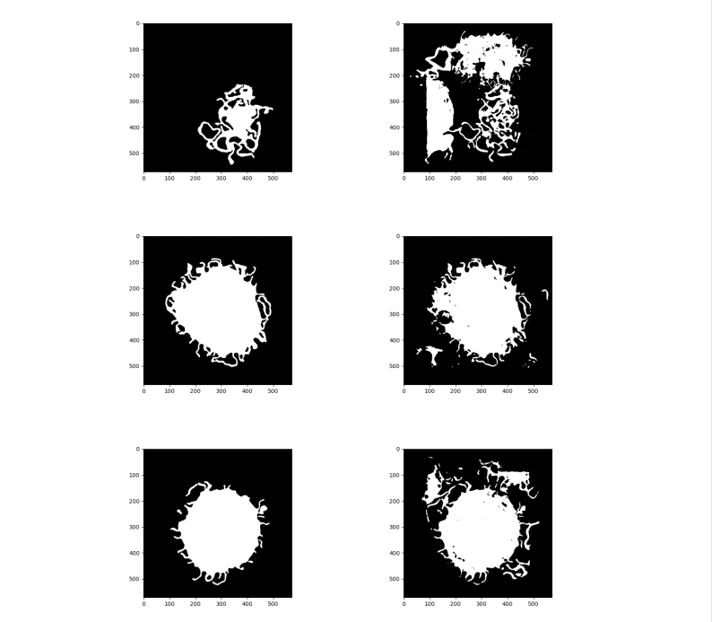
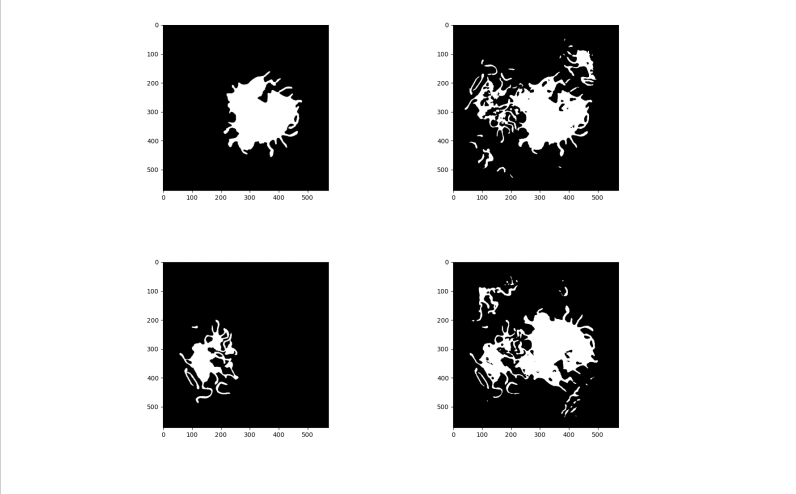
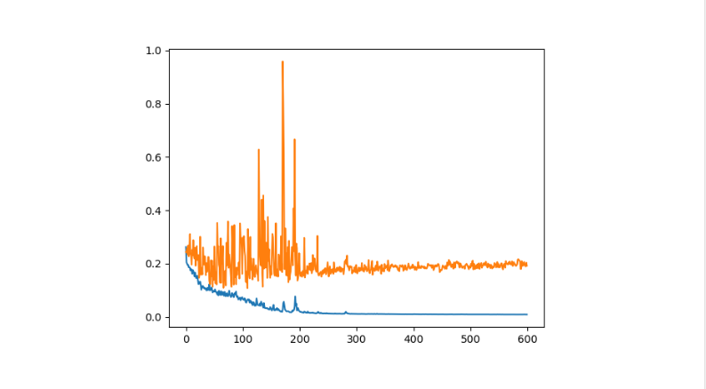

# U-Net
## implementation of U-Net
Implement the U-net architecture for cell image data segmentation using PyTorch.

Figure 1: U-Net architecture[1]

#### Data augmentation:
Since the size of the data is too small for training a neural network with a huge number of
parameters. Under this situation, the code has the following data augmentation applied:
1. Horizontal/Vertical flip
2. Zooming
3. Rotation

#### Final Results:

#### References
[1]Olaf Ronneberger, Philipp Fischer, and Thomas Brox. U-net: Convolutional networks for
biomedical image segmentation. InInternational Conference on Medical image computing and
computer-assisted intervention, pages 234–241. Springer, 2015.
